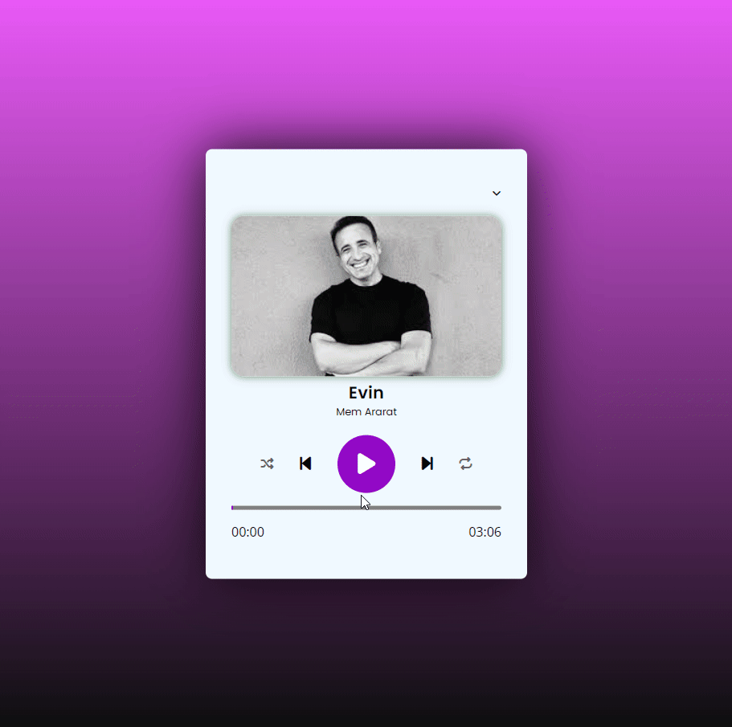

<h1>Müzik Çalar Projesi</h1>

Bu proje basit bir web tabanlı müzik çaları içerir. Kullanıcılar çalma listesindeki şarkıları oynatabilir, duraklatabilir, önceki/sonraki şarkılara geçiş yapabilir ve karıştırma/döngü özelliklerini kullanabilirler.

<h2>Ekran Görüntüsü</h2>

<h2>Kullanım</h2>

- `index.html` dosyasını tarayıcınızda açarak müzik çalar arayüzüne erişebilirsiniz.
- Çalma listesindeki şarkılardan birine tıklayarak o şarkıyı çalabilirsiniz.
- Müzik çaların altındaki kontrol butonları ile çeşitli işlemler yapabilirsiniz.

 

<h2>Teknolojiler</h2>

- HTML
- CSS
- JavaScript
- Font Awesome (ikonlar için)
- Google Fonts (fontlar için)

